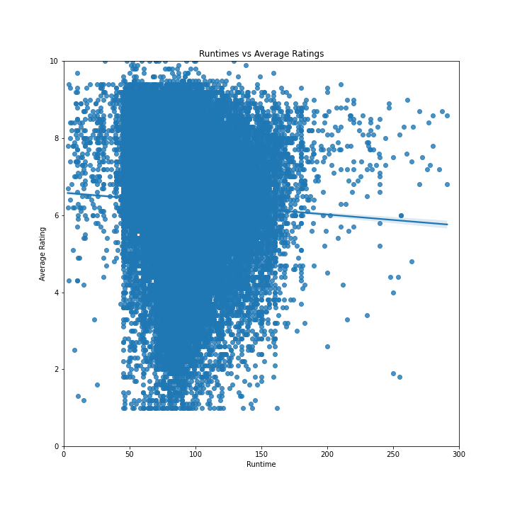
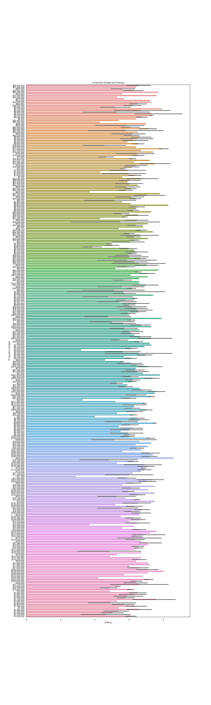

# Helping Micosoft Take Over the Film Industry.

**Authors**: Le Truong

## Overview

Microsoft is one of the world's leading technology companies. The company is always changing and implementing new and exciting changes to their flagship programs such as their operating system and office suite. Recently, Microsoft has expressed interest in entering the film industry. They recruited the help of Flatiron School and their data scientist students. They want an initial consultation to help give them ideas on how to help make a successful film. For this initial consultation, ratings will be the primary focus.  


## Business Problem

Our overarching question is "What can Microsoft do with the information we provide for them?" With that in mind, we are hoping to give Microsoft information on how certain factors relate with movie ratings. We are trying to see how certain factors correlate with movie ratings. We are looking at the following comparisons:
- Do longer movies(<=300) have lower ratings?
- Are there specific genres that generally get higher ratings?
- Do movies with higher production budgets get higher ratings?
These questions will give Microsoft some idea of what they should focus on when they begin their movie making process.


## Data

Flatiron provided us with data from IMDB and we used it to isolate information on movie ratings, genre, runtime, and production budgets. As stated before, our target variable is rating and how it interacts with the other mentioned variables. 
The purpose of comparing these variables with movie ratings is to show how they correlate. We need to understand these relationships because we are using the ratings variable to determine movie success. For the purpose of this presentation, we will say any movie that scores over a 6.0 rating is successful.

## Methods

In order to begin our analysis, we had to obtain and extract our data from Flatiron. After we finished that step, we isolated and "cleaned our data". What that entails is identify what variables we wanted and discarding what wasn't needed. We organized our data by removing null values so it wouldn't skew our data. At this point, if we had different variables in different tables, we'd merge together our data. This is important because we need two variables to make comparisons with. Then we aligned and sorted our data as necessary. Finally, we selected our data and made visualizations using Seaborn. It is important to note for this presentation, we only used statistical analysis for one comparison. The other two comparisons we able to perform analysis visually. 

## Results

1. 
We compared move runtime with average movie ratings to predict an ideal movie duration. What we found was that there was a slight negative correlation between movie lenght and ratings. However, the analysis was not strong enough to conclude ratings get lower if a movie is longer. The Pearson coefficient for this graph was only -0.044.
***
2. 
Upon looking at our genre table and comparing it with ratings, we were hoping to isolate specific genres to see if certain ones got higher ratings. We found that action, adventure, drama, and SciFi films, on average, got rated higher. 

3. 
With this comparison, we were hoping to see if a movie started out with a higher, starting production budget, would it rank higher than a movie with a lower starting production budget. What we were able to find that movies with a higher production budget, generally ranked higher than movies with lower starting budgets. It's not always the case as the data shows, but yes, production bugets do influence the movie's overall ratings. 

## Conclusions

In an attempt to help Microsoft produce a successful film, we focused on movie ratings and its relationship with other variables in the movie industry. We were able to find that runtime doesn't impact ratings, genres matter, and production budgets sometimes matter. With this information Microsoft needs to focus on films that fall within the action, drama, adventure, and/or SciFi genres. Sometimes a big production value will be able to help produce a better film, but smaller buget films also rate higher than films with huge starting budgets. 

Lack of dept is a problem with this analysis. As stated before, this information is used for an inital consultation to help give Microsoft an idea of what direction they should go. However, it opens the door to many questions the current analysis will not be able to answer. For example, it is unclear that films with higher ratings will be profitable for Microsoft. As Microsoft is a business, it is important for them to think about their profit after a film is made. Another problem with this analysis is that there might be TOO MUCH data and it could potentially influence the results. When comparing runtimes and ratings, we had nearly 66,000 points with various runtimes and ratings. Some of the shorter movies with lower ratings could have skewed the data.

As stated before, it would be important to compare total profits of films with higher ratings and specific genres. We already identified which generes will be specific, but we can narrow down even more information for Microsoft by digging deeper into those variables. Microsoft can make as many movies as they want, but if nothing turns out a profit then there is no point in them being in the film industry. 


## For More Information

For any additional questions, please contact Le Truong @ le.truong711@gmail.com

## Repository Structure

```
├── MICROSOFTPHASE1_README.md           <- The top-level README for reviewers of this project
├── Microsoft Consultation.ipynb        <- Narrative documentation of analysis in Jupyter notebook
├── Microsoft Presentation.pdf          <- PDF version of project presentation
├── data                                <- Both sourced externally and generated from code
└── images                              <- Both sourced externally and generated from code
```
